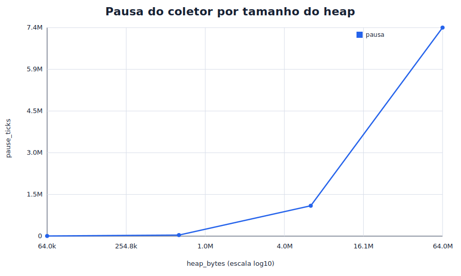
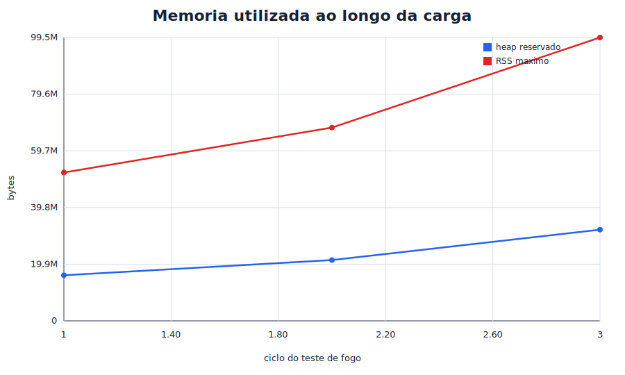
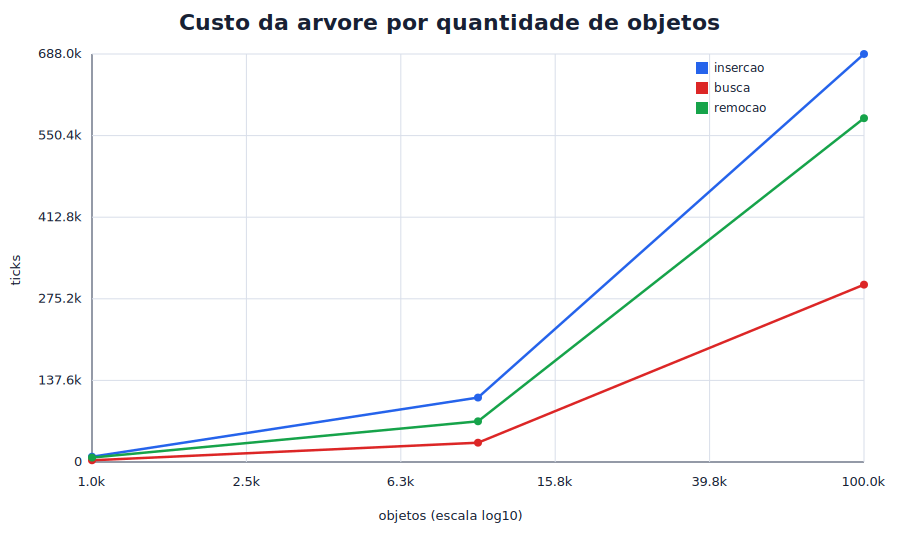
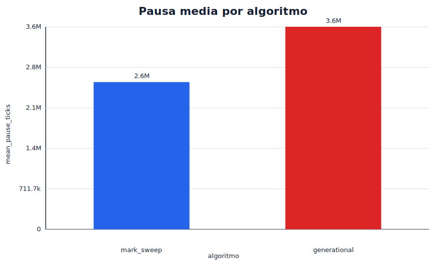

# Relatorio do coletor de lixo geracional

## Resumo

Este relatorio descreve a implementacao incremental de um coletor de lixo
conservador em C11 para Windows 11 x86-64. O projeto combina uma arvore AVL de
intervalos, heap obtido por `VirtualAlloc()`, marcacao conservadora de raizes,
sweep iterativo, duas geracoes, remembered set e barreira de escrita baseada em
`VirtualProtect()`. A validacao usa testes unitarios, programas-cobaia,
sanitizadores, teste de fogo, benchmarks e graficos reproduziveis.

O objetivo experimental e observar tres dimensoes: custo da arvore de
intervalos, comportamento de pausa e memoria sob cargas crescentes, e comparacao
entre mark-sweep puro e coleta geracional. Os resultados foram gerados pelos
executaveis do proprio repositorio e salvos em `data/`, com graficos em
`plots/`.

## 1. Introducao

Coletores de lixo automatizam a liberacao de memoria e reduzem a necessidade de
`free()` explicito pelo programa cliente. Em C, isso exige cuidado extra, pois a
linguagem nao guarda metadados de tipos, nao distingue ponteiros de inteiros e
permite aritmetica de ponteiros. Por isso, este projeto adota uma estrategia
conservadora: valores que parecem apontar para objetos gerenciados sao tratados
como referencias possiveis.

A API publica atual permite inicializar o coletor, alocar com `gc_malloc()`,
cadastrar raizes explicitas, forcar coletas e consultar estatisticas. O
desenvolvimento foi dividido em commits pequenos para manter rastreabilidade:
primeiro build e testes, depois arvore de intervalos, heap com `VirtualAlloc()`,
mark-sweep, raizes automaticas, arenas, geracoes, barreira de escrita, teste de
fogo, benchmarks, graficos e documentacao.

## 2. Fundamentacao teorica

O problema central e descobrir rapidamente se uma palavra encontrada na pilha,
nos registradores ou dentro de outro objeto aponta para algum objeto gerenciado.
Uma busca linear em todos os objetos teria custo `O(n)` por candidato, o que
ficaria caro durante a marcacao. A solucao usada e uma arvore AVL de intervalos.

Cada objeto e representado como intervalo semiaberto `[start, end)`. A arvore e
ordenada pelo endereco inicial e guarda, em cada no, o maior `end` da subarvore
(`max_end`). Esse campo permite podar buscas: se o candidato e maior ou igual ao
`max_end` da esquerda, aquela subarvore nao pode conter o endereco. Como a AVL
mantem altura logaritmica, a expectativa em arvore balanceada e busca em
`O(log n)`.

O coletor mark-sweep tem duas fases principais. Na marcacao, raizes conhecidas
sao examinadas e objetos alcancaveis sao colocados em uma fila de trabalho. A
fila evita recursao profunda, importante para listas longas e grafos ciclicos.
Na varredura, objetos nao marcados sao recuperados, enquanto objetos marcados
tem a marca limpa para o proximo ciclo.

O coletor geracional parte da hipotese de que muitos objetos morrem jovens.
Alocacoes novas entram na geracao jovem. Coletas menores examinam jovens e
referencias relevantes vindas de antigos. Objetos que sobrevivem ao limiar de
promocao passam para a geracao antiga. Coletas maiores periodicas varrem ambas
as geracoes para recuperar lixo antigo.

## 3. Arquitetura implementada

O heap e obtido por `VirtualAlloc()`. Objetos pequenos sao alocados em arenas de
64 KiB, com classes de tamanho de 32, 64, 128, 256, 512 e 1024 bytes. Objetos
maiores usam mapeamentos dedicados. Essa decisao substitui o prototipo inicial
de um mapeamento por objeto, que seria inviavel em cargas de milhoes de objetos.

Os metadados ficam fora da area visivel ao usuario e incluem intervalo, tamanho
solicitado, tamanho reservado, geracao, contagem de sobrevivencias, marca e
estado de mapeamento. Em modo debug, canarios detectam corrupcao nos limites
logicos do objeto.

As raizes vem de tres fontes: raizes explicitas cadastradas pelo usuario, pilha
e registradores. A pilha e examinada conservadoramente dentro dos limites
capturados no ambiente Windows atual. Os registradores sao capturados via
`setjmp()`, tratando o `jmp_buf` como regiao conservadora. Candidatos
desalinhados sao lidos com `memcpy()` para evitar comportamento indefinido.

A barreira de escrita usa `VirtualProtect()` em paginas antigas protegiveis. Ao
escrever em uma pagina antiga somente leitura, o tratador vetorizado marca a
pagina como suja e restaura permissao de escrita. Na coleta menor, paginas
sujas alimentam o remembered set, permitindo preservar jovens referenciados por
objetos antigos.

## 4. Metodologia experimental

Os dados foram produzidos com os alvos do `Makefile`:

```powershell
mingw32-make all test
mingw32-make sanitize
mingw32-make stress
mingw32-make benchmark
mingw32-make plots
```

Os benchmarks emitem CSVs e o script `scripts/generate_plots.py` gera SVGs sem
edicao manual de valores. Os arquivos usados neste relatorio sao:

- `data/scale.csv`;
- `data/fire.csv`;
- `data/tree.csv`;
- `data/collectors.csv`;
- `plots/pause_vs_heap.svg`;
- `plots/memory_vs_progress.svg`;
- `plots/tree_cost_vs_objects.svg`;
- `plots/collector_pause_comparison.svg`.

O ambiente validado e Windows 11 x86-64, processo de uma thread, GCC
MinGW-w64/MSYS2 com C11 estrito. AddressSanitizer e UndefinedBehaviorSanitizer
sao executados pelo alvo `sanitize`. Dr. Memory nao estava disponivel no
ambiente atual e ficou registrado como validacao complementar pendente.

## 5. Resultados

### 5.1 Pausa em funcao do tamanho do heap



No benchmark de escala, a carga cresce de `10^3` ate `10^6` objetos. A tabela
resume os dados principais.

| Objetos | Heap reservado | Bytes coletados | Pausa (ticks) | RSS maximo |
|---:|---:|---:|---:|---:|
| 1.000     | 64.000       | 32.000           | 5.608        | 4.354.048 |
| 10.000    | 640.000      | 320.000          | 38.108       | 6.070.272 |
| 100.000   | 6.400.000    | 3.200.000        | 1.082.962    | 21.995.520 |
| 1.000.000 | 64.000.000   | 32.000.000       | 7.435.072    | 180.744.192 |

O crescimento de pausa acompanha o aumento do heap e do volume de objetos a
examinar. A pausa nao cresce linearmente perfeita, pois o custo tambem depende
de localidade, estruturas internas, quantidade de candidatos conservadores e
estado das arenas.

### 5.2 Memoria utilizada durante o teste de fogo



O teste de fogo cria ciclos, referencias cruzadas e subconjuntos de raizes que
sao removidos ao longo dos ciclos. Ao final de cada ciclo, `live_bytes` volta a
zero, indicando que o lixo conhecido foi recuperado apos as coletas esperadas.

| Ciclo | Objetos | Heap reservado | Bytes coletados | Menores | Maiores |
|---:|---:|---:|---:|---:|---:|
| 1 | 250.000 | 16.000.000 | 6.000.000 | 9 | 2 |
| 2 | 333.333 | 21.333.312 | 13.999.992 | 18 | 4 |
| 3 | 500.000 | 32.000.000 | 25.999.992 | 27 | 6 |

O resultado mostra estabilidade funcional: ciclos mortos sao recuperados e
objetos vivos preservados enquanto suas raizes existem. O aumento de RSS maximo
acompanha a escala da carga, como esperado.

### 5.3 Custo da arvore de intervalos



O benchmark da arvore usa sementes fixas e tres repeticoes por tamanho. As
medias observadas foram:

| Nos | Altura | `ceil(log2(n))` | Insercao media | Busca media | Remocao media | Comparacoes/busca |
|---:|---:|---:|---:|---:|---:|---:|
| 1.000 | 12 | 10 | 8.945 | 2.895 | 7.480 | 9,21 |
| 10.000 | 16 | 14 | 108.663 | 32.540 | 68.615 | 12,56 |
| 100.000 | 20 | 17 | 688.006 | 299.062 | 579.748 | 15,95 |

As alturas ficam proximas de `log2(n)` e as comparacoes medias crescem de forma
logaritmica. Isso confirma empiricamente que a arvore esta cumprindo o papel de
evitar busca linear durante a marcacao conservadora.

### 5.4 Comparacao entre mark-sweep puro e geracional



O benchmark `bench_compare_collectors` executa a mesma carga com 50.000 objetos,
aquecimento e tres repeticoes.

| Algoritmo | Media pausa | Mediana pausa | Dispersao pausa | Menores | Maiores |
|---|---:|---:|---:|---:|---:|
| mark_sweep | 2.587.211 | 2.701.035 | 417.356 | 0 | 7 |
| generational | 3.558.598 | 3.513.272 | 273.674 | 6 | 1 |

Nesta carga especifica, a versao geracional teve pausa media maior que o modo
mark-sweep puro. Isso nao invalida a abordagem geracional: mostra que, com a
carga usada, o custo adicional de geracoes, promocao, remembered set e barreira
superou o beneficio de evitar varrer antigos em parte das coletas. A vantagem
geracional tende a aparecer melhor em cargas com muitos objetos antigos vivos e
alta mortalidade de objetos jovens.

## 6. Interpretacao e ameacas a validade

Os resultados da arvore sao os mais proximos da teoria: altura e comparacoes
seguem crescimento logaritmico. Ja as pausas do coletor misturam varios custos:
varredura conservadora, consultas na arvore, manipulacao de arenas, canarios,
estatisticas, remembered set e efeitos do sistema operacional.

Os benchmarks sao reproduziveis, mas nao universais. Uma unica maquina Windows,
um unico compilador e cargas sinteticas nao representam todos os programas em C.
Tambem ha interferencia de cache, escalonamento do sistema operacional e estado
do processo. Por isso, os graficos devem ser lidos como evidencia experimental
do projeto, nao como prova geral de desempenho de coletores geracionais.

Outra ameaca e a propria natureza conservadora. Um valor inteiro pode coincidir
com endereco de objeto e reter lixo. Isso e aceitavel para seguranca, pois evita
coletar objeto vivo, mas pode inflar memoria viva aparente e alterar pausas.

## 7. Limitacoes de engenharia

O projeto suporta apenas Windows 11 x86-64 e uma thread. A barreira com
`VirtualProtect()` protege apenas paginas antigas adequadas; objetos antigos
pequenos em arenas podem compartilhar pagina com jovens e estruturas internas,
entao ainda exigem tratamento conservador. Em builds com AddressSanitizer, a
barreira por protecao de pagina e desativada para evitar conflito com SEH e
shadow memory.

O Dr. Memory nao foi executado porque nao estava instalado no ambiente. A
validacao dinamica disponivel foi feita com ASan/UBSan. Como alternativa
pratica em Windows, podem ser usados Application Verifier/PageHeap e WinDbg,
mas isso nao substitui o Dr. Memory de forma perfeita.

## 8. Erros, tentativas e influencia da IA

O `DIARIO.md` registra as principais intervencoes. Houve correcoes importantes:
ajuste de compatibilidade Windows no uso de `max_align_t`, remocao de Dr. Memory
quando a ferramenta nao estava disponivel, revisao apos mudancas externas no
repositorio, correcao de comandos paralelizados que causaram `Permission denied`
ao linkar executaveis em uso e ajuste do alvo `plots` para usar barras
invertidas quando havia redirecionamento no `cmd.exe`.

A IA contribuiu principalmente como agente de implementacao incremental,
auditoria e documentacao. O historico mostra tambem limites dessa ajuda: quando
uma sugestao produziu erro de ambiente ou excesso de escopo, o erro foi
registrado e corrigido. A decisao de manter `PLAN.md`, `SKILL.md`, `DIARIO.md`
e commits pequenos ajudou a impedir que o projeto virasse um bloco opaco de
codigo gerado.

## 9. Conclusao

O projeto atinge o objetivo central: implementar um coletor conservador em C11
para Windows, com arvore AVL de intervalos, heap via `VirtualAlloc()`, raizes
explicitas e automaticas, mark-sweep, duas geracoes, remembered set, barreira
com `VirtualProtect()`, testes, benchmarks e graficos reproduziveis.

Os resultados confirmam que a arvore fornece comportamento logaritmico e que o
coletor recupera ciclos e lixo conhecido nas cargas testadas. A comparacao entre
mark-sweep puro e geracional mostra que a versao geracional ainda depende do
perfil da carga para superar o custo adicional de sua infraestrutura. Como
proximo passo fora do codigo, a equipe deve preencher as evidencias humanas de
autoria e preparar a defesa presencial usando `docs/AUTHORSHIP_AUDIT.md`.

## 10. Validacao final

A entrega final foi validada em 2026-06-26 com:

```powershell
mingw32-make clean all test sanitize stress benchmark
```

O comando terminou com `exit_code=0`. Os logs finais estao arquivados em
`docs/validation/commit45-suite.txt` e
`docs/validation/commit45-suite-exit.txt`. Nenhuma correcao de codigo foi
necessaria na auditoria final.
